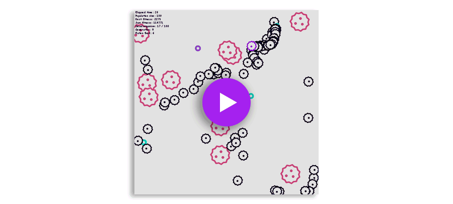
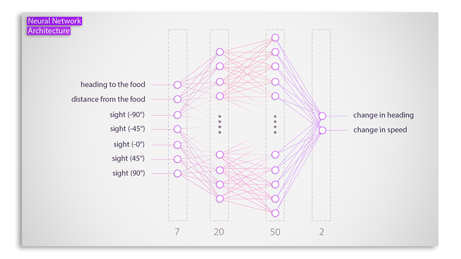

## Introduction

A simple artificial intelligence project that implements a machine learning 
algorithm using neural networks and a genetic algorithm.
The program teaches an organism how to find foods and avoid blocks to survive.
The project written entirely in Python using Pygame. 

## Demo

[](https://www.youtube.com/watch?v=DfSsdsgfGEs)

Watch this video to see it in action: [OrganismAi, Machine Learning using Neural Networks and Genetic Algorithms](https://www.youtube.com/watch?v=DfSsdsgfGEs)

## Configuration

The configuration can be done in `ai.py` file.

Parameter   | Description	| Default	
------------- | ------------------------- | ------------------------- 
population_size	| Number of individuals.    | 100
block_numbers	| Number of block in the simulation.    | 10
food_numbers	| Number of generated foods for each individual.    | 150
max_generation	| Maximum number of generation.    | 30
input_nodes_size	| Number of input nodes in the neural network.    | 7
hidden_nodes_size	| The nodes number of the first hidden layer.    | 20
hidden_nodes_2_size	|  The nodes number of the second hidden layer.    | 50
out_nodes_size	| Number of output nodes in the neural network.    | 2
mutation_rate	| The rate at which new mutation occurring in a genome.    | 0.01
elite_size	| Elite size specifies the number of individuals that are use to generate new generation.     | 10
always_generate_environment	| Load the same environment at every restart.    | True
draw_stats	| Plot a chart at the end of every generation, which show each generation's best and summarized fitness.    | False

## Neural Network Architecture

[](resources/neuralnetwork.png)

Each organism has its own neural network consisted of the next 4 layers:

1. an input layer with 7 neurons:
 ```
     1) heading to the food
     2) distance from the food
     3-7) sights at every 45 degree angle
 ```
2. a hidden layer with 20 neurons:
3. a hidden layer with 50 neurons:
4. an output layer with 2 neurons:
  ```
     1) change in heading
     2) change in speed
 ``` 
 
## Genetic Algorithm

Here are the main steps of the genetic algorithm:

1. Selection - Selection is the process by which, the pairs of individuals that will participate in crossover operation are
selected. The selection implemented with roulette wheel selection. `select_elite()` `pair()` 
2. Crossover - Crossover is the genetic operator that performs the
task of recombination of two individuals (parents) to
generate individuals of the new generation (offspring).  `crossover()`
3. Mutation - Mutation is the process by which new characteristics
are introduced into the population. `mutation()`